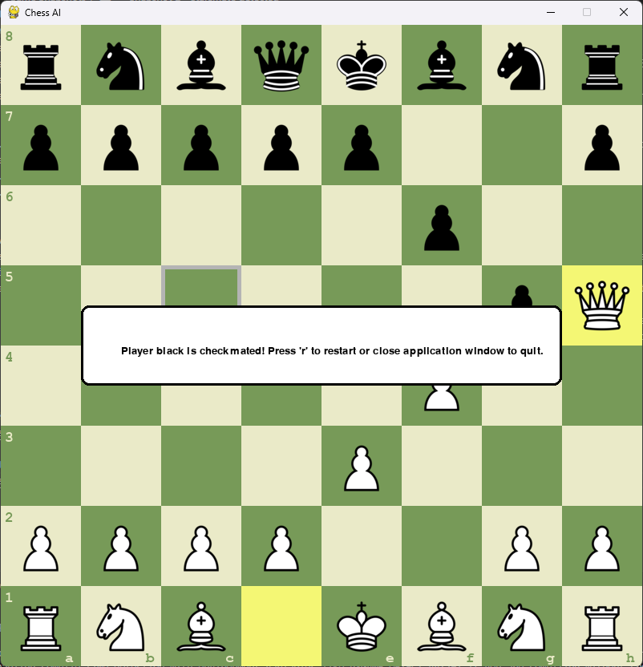
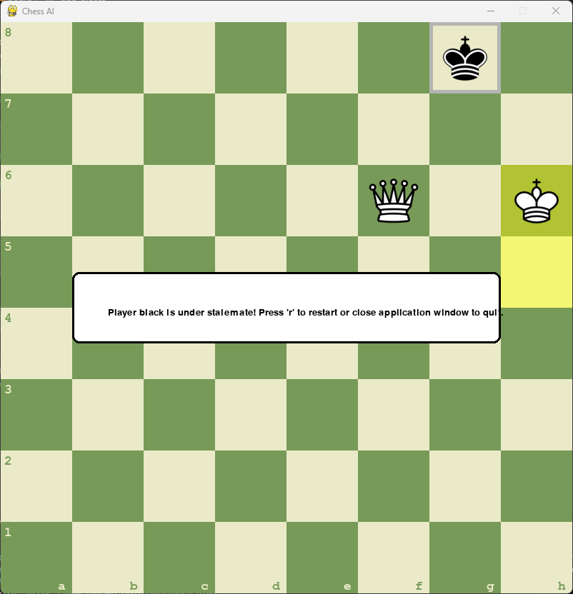

# Overview

This project is a chessboard with AI mode (AI mode not implemented yet) written in Python. It uses a pygame library.
It is an improved version of the chessboard project created by AlejoG10.
Alejo's original code is available on GH at https://github.com/AlejoG10/python-chess-ai-yt
AlejoG10 created also 5 hours long hands-on tutorial on Youtube. Watch it if you'd like to implement a chessboard "from scratch".
However I've found several bugs and missing functionalities in his implementation so I've decided to work on it.

# Game improvements

## Features not present in the original code:
 IMPLEMENTED:   Feature 1. Detect when a King is actually in check.
 IMPLEMENTED:   Feature 2. Detect checkmate position.
 IMPLEMENTED:   Feature 3. Detect stalemate position.
 TODO:          Feature 4. Detect draw: position repeated 3 times, both players don't not enough material to win, 50 moves without capturing a piece.
 TODO:          Feature 5. Implement Player versus Computer AI using simple minimax algorithm
 TODO:          Feature 6. Implement Player versus Computer AI using better method (hopefully reinforcement learning)

## Bugs:
 FIXED:     Bug 1. There was a bug in calculating list of valid moves for King if he is in check or some fields around King is "in check". 
            It prevents King under check to make a valid move and it cannot move
 FIXED:     Bug 2. Sometimes a Knight couldn't capture an enemy piece if that enemy piece was giving a check
 FIXED:     Bug 3. King was allowed to move to a square adjacent to an enemy King and as a result it could capture enemy King.

## Improvements:
 TODO:      Improvement 1. Efficient method of avoiding putting the king in check suggested by 'Wave Treader':
 "This method does not need any copy or simulating all possible moves, it does not need to check for all opponent's possible moves. 
 It works like this.... you must have tracked the kings position every move and save it. 
 Make the move even if it puts the king in check, from there check from the king's position if any piece attacks it by looking at capture moves from the king's position. 
 If it results in a capture, just undo the move. it happens really fast you wont see the invalid move being executed. 
 The idea is that you make a function that assumes the king can move like a queen, bishop, rook, knight or pawn capture."

# Game Snapshots

## Snapshot 1 - Checkmate detected

## Snapshot 2 - Stalemate detected

# How to run?
1. Clone or download the project, then go to the project's main directory
2. pip install -r requirements.txt
3. python .\src\main.py # on Windows OS