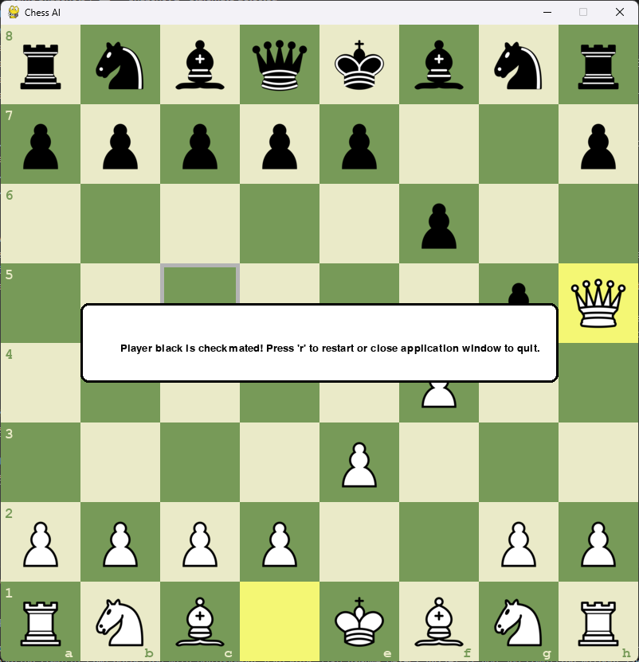
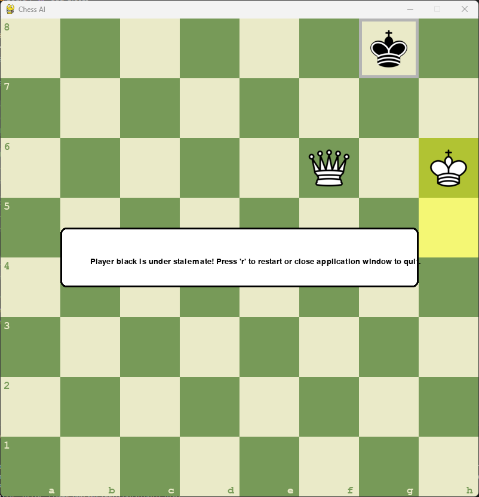
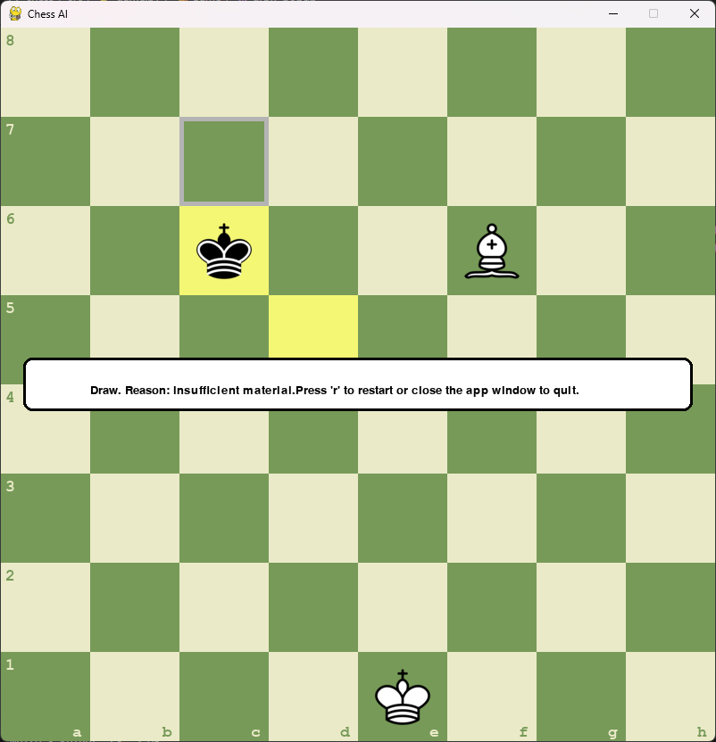
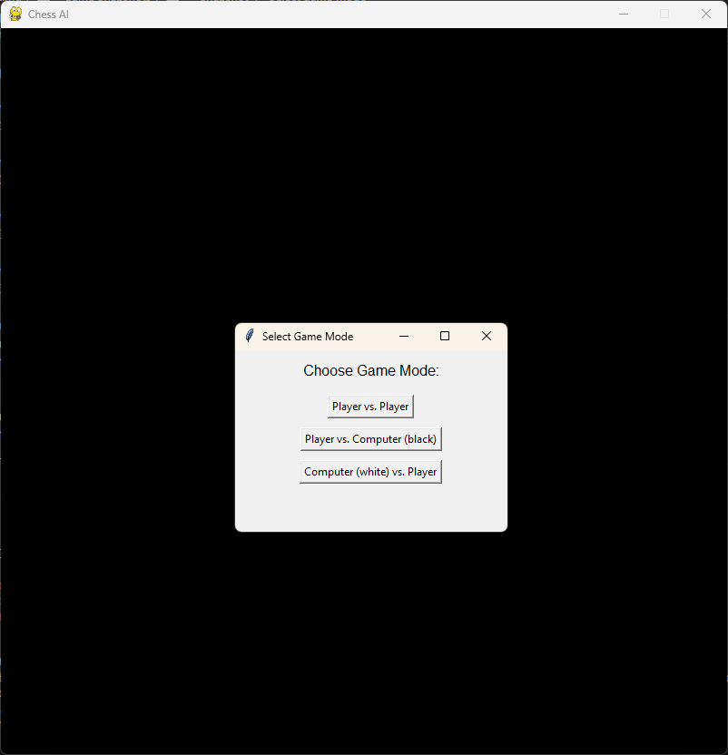

# Overview

This project is a chessboard with AI mode written in Python. It uses a pygame library.  
It is an improved version of the chessboard project created by AlejoG10.  
Alejo's original code is available on GH at https://github.com/AlejoG10/python-chess-ai-yt  
AlejoG10 has also created 5 hours long hands-on tutorial on Youtube https://www.youtube.com/watch?v=OpL0Gcfn4B4 (watch it if you'd like to implement a chessboard "from scratch").  
However I've found several bugs and missing functionalities in his implementation so I've decided to work on it.  

## About the most recent version of the project:  
- It implements minimax with alpha-beta pruning for the AI.  
- Performance has improved dramatically since the original version — see [IMPROVEMENTS.md](IMPROVEMENTS.md) for the full history of fixes and speedups.  
- You can select 3 game modes: player vs. player, player vs. AI and AI vs. player.  
- Playing strength can be estimated automatically against Stockfish — see [How to estimate AI strength (Elo)](#how-to-estimate-ai-strength-elo) below.  

AI_MAX_DEPTH = 2 predicts 3 piece moves ahead and moves in well under a second.  
AI_MAX_DEPTH = 3 now takes a few seconds (down from ~30 s before alpha-beta pruning was added).  
At the time of writing the engine measures at roughly **1200 Elo at depth 2** (see the Elo estimation section) — there's plenty of room left to improve, and [IMPROVEMENTS.md](IMPROVEMENTS.md) tracks what's next.  

# Game Snapshots

## Snapshot 1 - Checkmate detected

## Snapshot 2 - Draw - stalemate detected

## Snapshot 3 - Draw - insufficient material

## Snapshot 4 - Select game mode

## How to run?
1. Clone, fork or download the project, then go to the project's main directory  
2. pip install -r requirements.txt  
3. python .\src\main.py # on Windows OS  
  
## How to run tests?

Regression tests live in the tests directory: castling, sliding moves, en passant, checkmate scoring, alpha-beta equivalence, a handful of other state-bug regressions and a perft harness comparing move counts against known reference values (start position, Kiwipete, CPW position 3).  

1. python -m pytest tests # whole suite (pytest is in requirements.txt)  
2. python .\tests\test_perft.py # each test file also runs standalone, no extra dependencies  
3. python .\tests\test_perft.py --deep # additionally verifies the slow deep counts (startpos perft(4) = 197,281)  

There is also an AI timing benchmark (not part of the test suite) to measure performance improvements:  

1. python .\tests\benchmark_ai.py # times AI.best_move() at depths 2 and 3  
2. python .\tests\benchmark_ai.py 2 # or at the depths you list  

## How to estimate AI strength (Elo)?

`tools/elo_estimate.py` plays rated games against [Stockfish](https://stockfishchess.org/) limited to a calibrated Elo strength and computes a maximum-likelihood rating estimate for the app's AI. Details, method and measurement history are in [IMPROVEMENTS.md](IMPROVEMENTS.md#4-verification).

**1. Install Stockfish** (one-time, not needed just to play the game):
- Windows: `winget install Stockfish.Stockfish` (adds a `stockfish` command to PATH after restarting the shell), or download a binary from [stockfishchess.org/download](https://stockfishchess.org/download/) and note its path.
- If the binary isn't on PATH, either pass it explicitly (`--stockfish "C:\path\to\stockfish.exe"`) or set an environment variable: `$env:STOCKFISH_PATH = "C:\path\to\stockfish.exe"`.

**2. Install the Python dependency** (already included in requirements.txt): `pip install -r requirements.txt` (or just `pip install chess`).

**3. Run it:**
1. python .\tools\elo_estimate.py --quick # ~20 games, rough estimate, a few minutes  
2. python .\tools\elo_estimate.py # ~100 games, ±50 Elo accuracy, roughly 30 min at depth 2  
3. python .\tools\elo_estimate.py --depth 3 --games 40 # rate a different search depth  
4. python .\tools\elo_estimate.py --selftest # verify the rating math only, no games played  

Every run appends a row (date, git commit, depth, games, per-level win/draw/loss, Elo estimate) to `tools/elo_history.csv` — a strength log to track across future improvements.  
**Latest measurement:** ~1190 Elo at depth 2 (95% CI 952-1382), 2026-08-05.  

## You can choose which version of the code to run and work on.  
Available tags:  
- baseline_no_AI  - minimal changes to original AlejoG10 code  
- minimax_slow_AI - above + introduced player vs AI mode
- minimax_v2_AI - above + performance improved ~5 times

# List of game improvements

NOTE: A detailed, prioritized list of further correctness fixes and performance improvements (with exact file/line references) is maintained in [IMPROVEMENTS.md](IMPROVEMENTS.md).  

## Features not present in the original code:
 IMPLEMENTED:   Feature 1. Detect when a King is actually in check.  
 IMPLEMENTED:   Feature 2. Detect checkmate position.  
 IMPLEMENTED:   Feature 3. Detect stalemate position.  
 IMPLEMENTED:   Feature 4. Detect draw position in case of: position on the board repeated 3 times OR both players don't have enough material to win OR 50 moves made without capturing a piece and no pawn move. See details on: https://en.wikipedia.org/wiki/Draw_%28chess%29#Draws_in_all_games 
 NOTE: 3 fold repetition detection was rewritten (the old method was disabled dead code) - it now follows FIDE article 9.2: same placement, same side to move, same castling rights, same en passant state. Covered by regression tests in tests/test_three_fold_repetition.py.  
 IMPLEMENTED:   Feature 5. Storing and displaying list of all moves made from the start of the game. (press 'd' key)  
 IMPLEMENTED:   Feature 6. Undo move. Implemented ONLY for player vs player mode. (press 'u' key)  
 IMPLEMENTED:   Feature 7. Implement simplest Player vs Computer AI using simple minimax algorithm.  
 IMPLEMENTED:   Feature 8. User can select 3 game modes: player vs. player, player vs. AI and AI vs. player.  
 IMPLEMENTED:   Feature 9. Implement optimized minimax algorithm (with alpha-beta pruning) for Player vs Computer AI. 5-47x speedup measured, see IMPROVEMENTS.md item 2.1.  
 IMPLEMENTED:   Feature 11. Automated Elo strength estimation vs Stockfish (tools/elo_estimate.py). See "How to estimate AI strength" above and IMPROVEMENTS.md section 4.  
 TODO:          Feature 10. Implement Player vs Computer AI using better method (hopefully reinforcement learning).  

## Bugs:
 FIXED:     Bug 1. There was a bug in calculating list of valid moves for King if he is in check or some fields around King is "in check".  
            It prevented King under check to make a valid move so it couldn't move.  
 FIXED:     Bug 2. Sometimes a Knight couldn't capture an enemy piece if that enemy piece was giving a check.  
 FIXED:     Bug 3. King was allowed to move to a square adjacent to an enemy King and as a result it could capture enemy King.  
 FIXED:     Bug 4. Queen, Rook, Bishop and Knight were allowed to capture enemy King when starting a game from other position than initial.  
 FIXED:     Bug 5. Sometimes when playing with AI, a user is not allowed to perform valid queenside Castling.  
            Root cause: castling in Board.move() executed the last move from the Rook's own move list, which goes stale during minimax (moves are recalculated with clear_moves=False), corrupting castling state.  
            Now the Rook relocation is derived directly from the King's destination square. Covered by regression tests in tests/test_castling.py.  
 FIXED:     Bug 6. Queen, Rook and Bishop could "see through" the enemy King: squares behind the King on the attack ray were generated as valid moves.  
            Root cause: the ray-terminating break in straightline_moves() was nested inside the "blocker is not a King" guard, so the enemy King did not stop the ray.  
            Covered by regression tests in tests/test_sliding_moves.py.  
 FIXED:     Bug 7. Castling was allowed through a square attacked by an enemy piece (and castling out of check was only prevented by accident).  
            Root cause: only the King's destination square was validated; the transit square (d1/d8 or f1/f8) was never tested for attack.  
            Now castling requires: King not in check, transit square not attacked, destination not attacked. Covered by regression tests in tests/test_castling_legality.py.  
 FIXED:     Bug 8. A pawn that advanced only one square could be captured "en passant", and undoing a move (also the internal undos of the minimax algorithm) marked whatever piece moved last - even a Knight or Rook - as capturable en passant.  
            Root cause: the en passant flag was set after ANY pawn move instead of only after a two-square push, and undo re-flagged the last moved piece unconditionally.  
            Now the flag is set only by a two-square pawn push and undo restores it only for such a pawn. Covered by regression tests in tests/test_en_passant.py.  
 FIXED:     Bug 9. The AI scored every checkmate in its search tree as a win for black, so as white it avoided delivering mate and as either color it could walk into one.  
            Root cause: check_win() ignored its color argument (any mate returned True for both colors), the mate/stalemate flags were not copied between board states so minimax nodes read stale values from previously explored branches, and mate scores were masked by the +/-1000 best_score initializers.  
            Now the win is attributed to the color that made the mating move, the flags are copied in copy_board_content(), and mates get finite depth-adjusted scores so the AI prefers the fastest mate. Covered by regression tests in tests/test_checkmate_scoring.py.  
 FIXED:     Bug 10. Deep search nodes could read a stale "captured" flag left over from a previous move, wrongly decrementing piece counters and corrupting insufficient-material/50-move draw detection inside the search.  
            Root cause: the flag was set only by external callers (the GUI and the minimax root), never by Board.move() itself. Now move() inspects the destination square before overwriting it. See IMPROVEMENTS.md item 1.7.  
 FIXED:     Bug 11. A pawn sitting on row 0 (reachable only during 7th-rank legality probes) could be reported as checking a king on row 7.  
            Root cause: the check-detection bounds guard tested the wrong row, so at row 0 a negative array index silently wrapped around to row 7. See IMPROVEMENTS.md item 1.8.  
 FIXED:     Bug 12. Auto-queen promotion ran even during legality probes, allocating a throwaway Queen object for every probe of a 7th-rank pawn move.  
            Now promotion only happens for real moves. See IMPROVEMENTS.md item 1.9.  
 FIXED:     Bug 13 (latent). Piece.is_black() always returned True regardless of input, silently ready to break the disabled int-based fast move-generation path if it were ever re-enabled. See IMPROVEMENTS.md item 1.11.  

NOTE: all correctness items tracked in IMPROVEMENTS.md section 1 (1.1 through 1.11) are now fixed - see that file for exact file/line references and regression test coverage.  

## Performance improvements:
 IMPLEMENTED:   Improvement 1. Increase performance by redesigning program data structures. Mainly to avoid very costly deepcopy() operations.  This will also simplify overall program logic.  
 
 IMPLEMENTED:   Improvement 3. Removed the opponent-has-no-valid-moves scan from every minimax node - the AI now detects mate/stalemate from its own legal move list, and the scan runs only after real (GUI) moves.  
                Measured: depth 3 move time dropped from 311 s to 138 s (start position) and from 823 s to 239 s (middlegame), with an identical search result. See IMPROVEMENTS.md item 2.2.  

 IMPLEMENTED:   Improvement 4. Alpha-beta pruning with captures-first move ordering, replacing plain minimax.  
                Measured: depth 3 move time dropped further to 4.5 s (start position, 27x vs. the pre-alpha-beta baseline) and 4.8 s (middlegame, 47x). Equivalence to plain minimax (same root score, same chosen move) is asserted by tests/test_alpha_beta.py. See IMPROVEMENTS.md item 2.1.  

 IMPLEMENTED:   Improvement 5. Assorted smaller wins: shallow-copy instead of deepcopy of piece move lists, depth-plumbing bugfix (AI(max_depth=...) constructor argument was silently ignored), cheaper leaf evaluation. See IMPROVEMENTS.md items 2.3, 2.5, 2.6.  

 TODO:          Improvement 2. Efficient method of avoiding putting the King in check suggested by 'Wave Treader':  
 "This method does not need any copy or simulating all possible moves, it does not need to check for all opponent's possible moves.  
 It works like this.... you must have tracked the kings position every move and save it.  
 Make the move even if it puts the king in check, from there check from the king's position if any piece attacks it by looking at capture moves from the king's position.  
 If it results in a capture, just undo the move. it happens really fast you wont see the invalid move being executed.  
 The idea is that you make a function that assumes the king can move like a queen, bishop, rook, knight or pawn capture."  

 TODO:          Improvement 6. Transposition table and iterative deepening (now that alpha-beta is in place). See IMPROVEMENTS.md section 3.  
 TODO:          Improvement 7. Make/unmake refactor: a single Board plus a small per-move undo record instead of 300 pre-allocated Board snapshots. Prerequisite for comfortable depth 4+. See IMPROVEMENTS.md section 3.  
 TODO:          Improvement 8. Remove print() calls from the search hot path. See IMPROVEMENTS.md item 2.4.  
