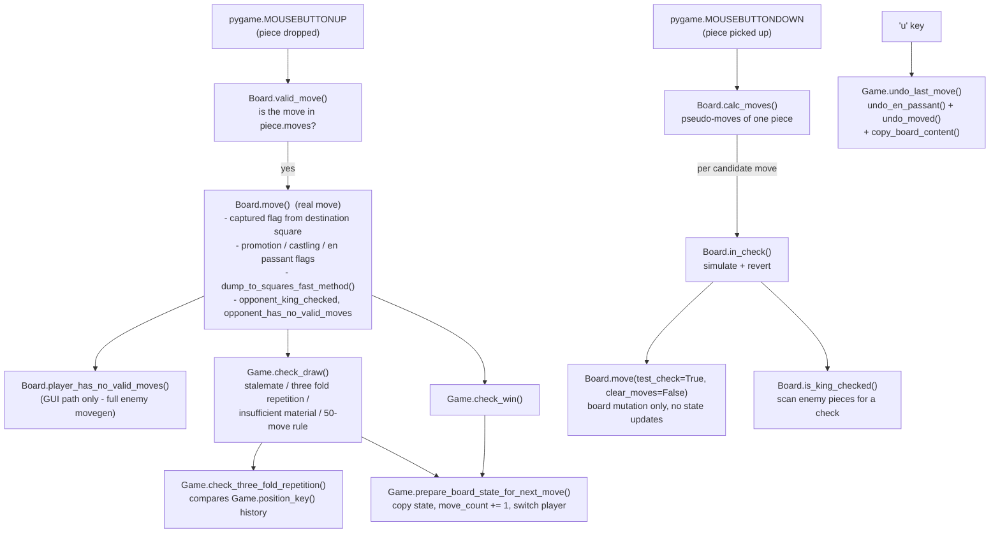
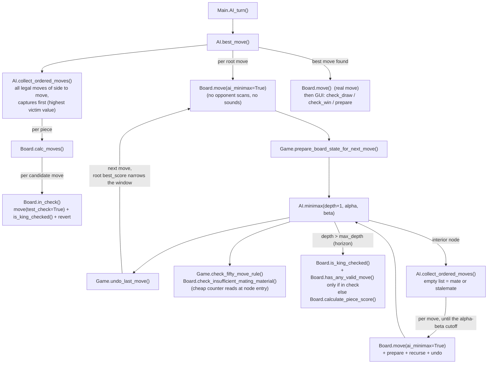

# Main methods behind the application algorithm

Call graph of the core methods, their interactions and per-call iteration counts.
Two entry paths exist: the **human (GUI) move** driven by pygame events in `main.py`,
and the **AI turn** driven by `AI.best_move()` in `minimax.py`. Both funnel into the
same `Board`/`Game` core methods.

## Human (GUI) move path

## AI turn path (minimax with alpha-beta pruning)

## Iteration counts (why each optimization matters)

| Method | Called | Iterations inside |
|---|---|---|
| `AI.minimax()` | ~b^d nodes without pruning; alpha-beta with captures-first ordering cuts this to roughly b^(d/2)..b^(3d/4) (measured 5-25x fewer at depth 2-3) | one `collect_ordered_moves()` + child recursion per node |
| `AI.collect_ordered_moves()` | once per search node + once at the root | 64 squares -> `calc_moves()` per own piece |
| `Board.calc_moves()` | per piece per node; also on GUI piece pickup | generates pseudo-moves; **one `in_check()` simulation per candidate move** - the dominant cost of the whole search |
| `Board.in_check()` | per candidate move | `move(test_check=True)` + `is_king_checked()` (scans up to 64 squares) + manual revert |
| `Board.move()` | once per node (real/search move) or per probe (`test_check=True`) | real move: 64-square `set_true_en_passant()` + 64-square `dump_to_squares_fast_method()`; probe: board mutation only |
| `Board.player_has_no_valid_moves()` | **GUI path only** (after a real move) - removed from the per-node search path (IMPROVEMENTS.md 2.2) | full enemy movegen incl. `in_check()` per move, early-exit on first legal move |
| `Board.has_any_valid_move()` | horizon nodes only, and only when the king is in check | early-exit enemy movegen |
| `Board.calculate_piece_score()` | once per horizon (leaf) node | 64 squares, material sum |
| `Game.check_three_fold_repetition()` | GUI path only (inside `check_draw()`) | scans position keys back to the last irreversible move |
| `Game.undo_last_move()` | once per search move + 'u' key | `copy_board_content()`: 2x 64-square copy |

## Important invariants

1. **`Board.in_check()` must call `move(test_check=True, clear_moves=False)`.**
   `test_check=True` skips every state update (fast-method dump, promotion, castling
   rook relocation, en passant flags, captured/counter updates) so the manual revert
   restores the board exactly. `clear_moves=False` preserves the `piece.moves` list
   being accumulated by the ongoing `calc_moves()` - clearing it would leave only the
   last calculated move.
2. **The search relies on move()/prepare()/undo() symmetry.** Every
   `Board.move(ai_minimax=True)` + `prepare_board_state_for_next_move()` pair inside
   minimax is reverted by exactly one `Game.undo_last_move()`, which also restores the
   shared `Piece.moved` / `Pawn.en_passant` attributes (they are objects shared across
   board states - see `undo_moved()` / `undo_en_passant()`).
3. **`player_has_no_valid_moves()` must never run inside the search.** Minimax derives
   mate/stalemate from its own empty legal-move list; the GUI flags
   (`opponent_king_checked` / `opponent_has_no_valid_moves`) are computed only when
   `ai_minimax=False`. It also only saves/restores `piece.moves` with a shallow copy
   `piece.moves[:]` - the old `deepcopy` recursed into whole `Piece` objects.
4. **Board history is stored as `squares_fast_method` int snapshots.** The `Piece`
   objects inside `squares` are shared between board states, so anything historical
   (moved flags for undo, en passant flags, repetition detection via
   `Game.position_key()`) must be decoded from the int encoding, never from `Piece`
   attributes of an older state.
